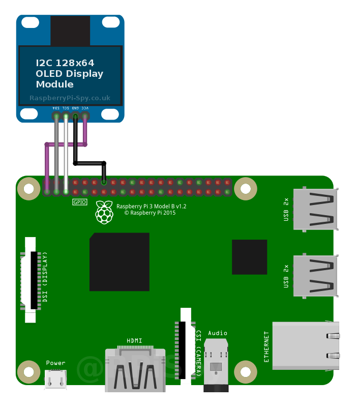

## Enable I2C Interface

The default Raspbian image disables I2C  by default so before you can use it the interface must be enabled. This  can be done using either of two methods. I’ll describe all methods but  the first one is probably easier and quicker.

### Method 1 – Using “Raspi-config” on Command Line

From the command line or Terminal window start by running the following command :

```
sudo raspi-config
```

This will launch the raspi-config utility. Select “Interfacing Options” :


Highlight the “I2C” option and activate “<Select>”.


Select and activate “<Yes>” :


Highlight and activate “<Ok>” :


When prompted to reboot highlight and activate “<Yes>” :


The Raspberry Pi will reboot and the interface will be enabled.

### Method 2 – Using “Raspberry Pi Configuration”

If  your Pi boots to the desktop you can either open a Terminal window and  use Method 1 or use the graphical tool “Raspberry Pi Configuration”.  This is found under **Menu > Preferences > Raspberry Pi Configuration**


Then you simply need to select the “Interfaces” tab and set I2C to “Enabled” :


Click the “OK” button. If prompted to reboot select “Yes” so that the changes will take effect.


The Raspberry Pi will reboot and the I2C interface will be enabled.

## Step 2 – Install Utilities

To help debugging and allow the interface to be used within Python we can install “python-smbus” and “i2c-tools” :

```
sudo apt-get update
sudo apt-get install -y python-smbus i2c-tools
```

## Step 3 – Shutdown

Shutdown your Pi using :

```
sudo halt
```

Wait ten seconds, disconnect the power to your Pi and you are now ready to connect your I2C hardware.

## Checking If I2C Is Enabled (Optional)

When you power up or reboot your Pi you can check the i2c module is running by using the following command :

```
lsmod | grep i2c_
```

That will list all the modules starting with “i2c_”. If it lists “i2c_bcm2708” then the module is running correctly.

## Testing Hardware (Optional)

Once  you’ve connected your hardware double check the wiring. Make sure 3.3V  is going to the correct pins and you’ve got not short circuits. Power up  the Pi and wait for it to boot.

If you’ve got a Model A, B Rev 2 or B+ Pi then type the following command :

```
i2cdetect -y 1
```

If you’ve got an original Model B Rev 1 Pi then type the following command :

```
i2cdetect -y 0
```

Why  the difference? Between the Rev 1 and Rev 2 versions of the Pi they  changed the signals that went to Pin 3 and Pin 5 on the GPIO header.  This changed the device number that needs to be used with I2C from 0 to  1.

I used a Pi 2 Model B with a sensor connected and my output looked like this :

```
pi@raspberrypi ~ $ i2cdetect -y 1
     0  1  2  3  4  5  6  7  8  9  a  b  c  d  e  f
00:          -- -- -- -- -- -- -- -- -- -- -- -- --
10: -- -- -- -- -- -- -- -- -- -- -- -- -- -- -- --
20: 20 -- -- -- -- -- -- -- -- -- -- -- -- -- -- --
30: -- -- -- -- -- -- -- -- -- -- -- -- -- -- -- --
40: -- -- -- -- -- -- -- -- -- -- -- -- -- -- -- --
50: -- -- -- -- -- -- -- -- -- -- -- -- -- -- -- --
60: -- -- -- -- -- -- -- -- -- -- -- -- -- -- -- --
70: -- -- -- -- -- -- -- --
```

This shows that I’ve got one device connected and its address is 0x20 (32 in decimal).

### Edit Config.txt File to set I2C Bus Speed

Using the following command the config.txt file can be edited :

```
sudo nano /boot/config.txt
```

Find the line containing “dtparam=i2c_arm=on”.

Add “,i2c_arm_baudrate=400000” where 400000 is the new speed (400 Kbit/s). Note the comma.

This should give you a line looking like :

```
dtparam=i2c_arm=on,i2c_arm_baudrate=400000
```

This enables the bus and sets the baudrate at the same time with a comma separating both parameters.

Use CTRL-X, then Y, then RETURN to save the file and exit.

## Step 3 – Reboot

Finally, reboot the Pi for the new setting to take effect :

```
sudo reboot
```

## Display Module Setup

My screen had four pins, two for power and two for the I2C interface.



I connected them directly to the Raspberry Pi’s GPIO header using the following scheme :

| OLED Pin | Pi GPIO Pin | Notes   |
| -------- | ----------- | ------- |
| Vcc      | 1 *         | 3.3V    |
| Gnd      | 14 **       | Ground  |
| SCL      | 5           | I2C SCL |
| SDA      | 3           | I2C SCA |

\* You can connect the Vcc pin to either Pin 1 or 17 as they both provide 3.3V.
 ** You can connect the Gnd pin to either Pin 6, 9, 14 , 20, 25, 30, 34 or 39 as they all provide Ground.


The following libraries may already be installed but run these commands anyway to make sure :

```
sudo apt-get install -y python-dev python3-dev
```

and :

```
sudo apt-get install -y python-imaging python-smbus i2c-tools
```

## Finding the OLED Display Module’s Address

With the I2C libraries installed I used the i2cdetect command to find the module on the I2C bus.

```
i2cdetect -y 1
```

and I got the following result :


This  was good news as it showed the device had been detected with an address  of “0x3c”. This is the default hex address for this type of device.  I’ve got no idea why the device PCB suggests the address is “0x78” when  it is clearly “0x3c”.

If you’ve got an original Model B Rev 1 Pi then type the following command instead :

```
i2cdetect -y 0
```

## Install OLED Python Library

In  order to display text, shapes and images you can use the Adafruit  Python library. It should work with all SSD1306 based displays including  their own [128×32 and 128×64 devices](https://www.adafruit.com/category/98).

To install the library run the following command :

```
git clone https://github.com/adafruit/Adafruit_Python_SSD1306.git
```

Once that completes navigate to the library’s directory :

```
cd Adafruit_Python_SSD1306
```

and install the library for Python 2 :

```
sudo python setup.py install
```

and/or Python 3 :

```
sudo python3 setup.py install
```

This process will give you ability to include the library within your own Python scripts.